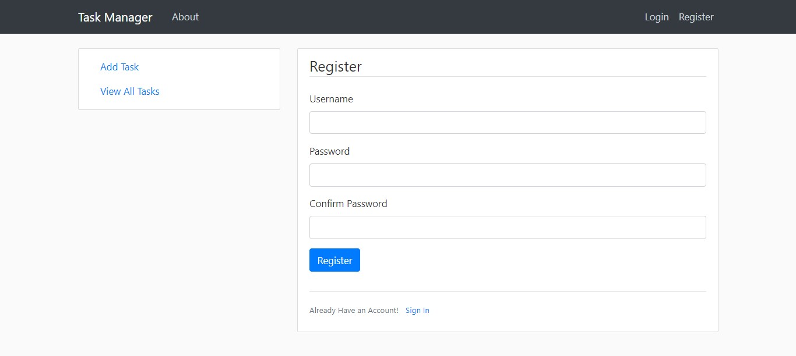
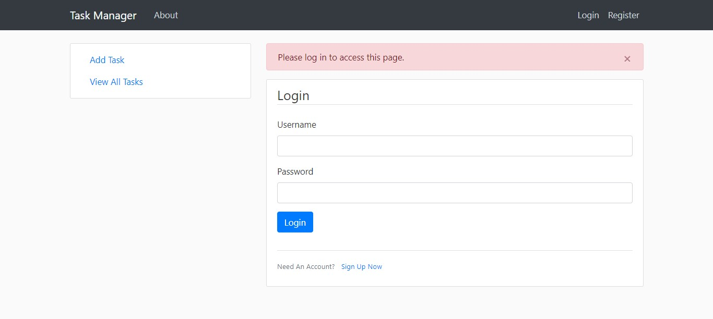
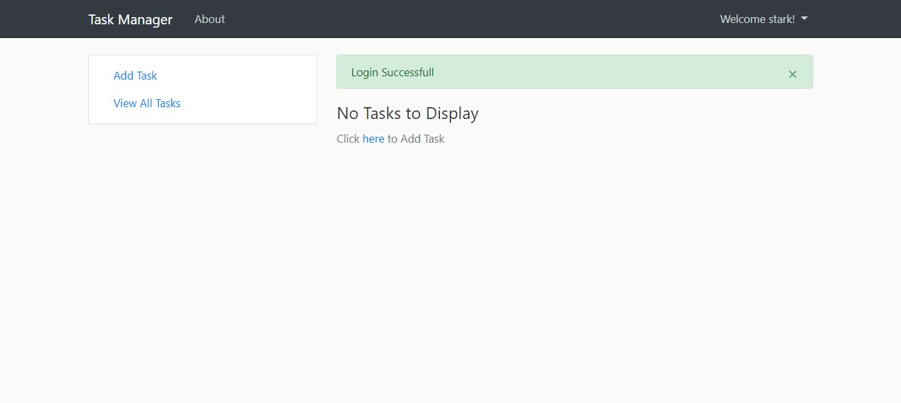
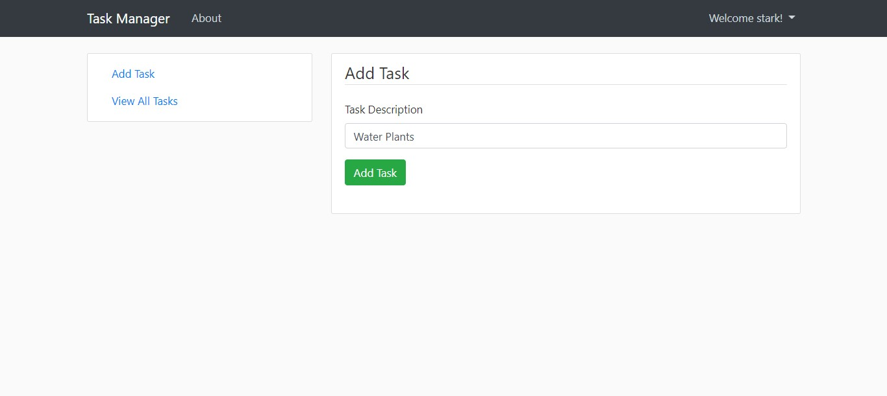
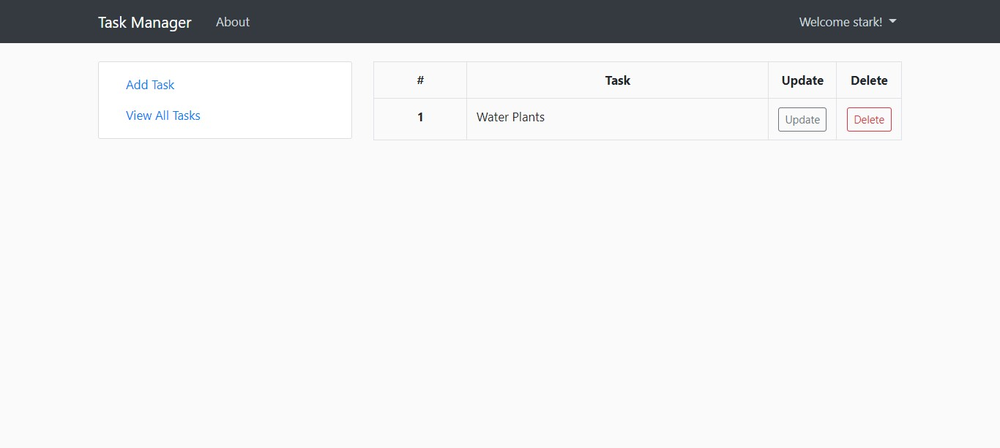
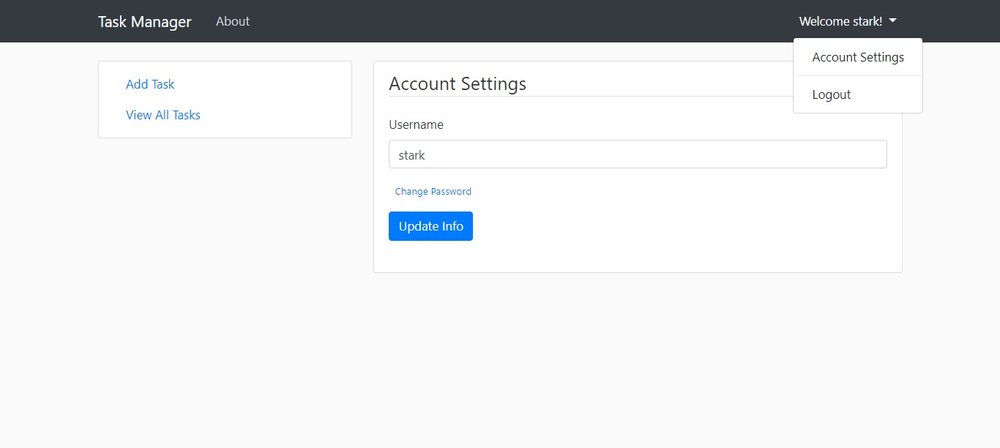

# Task-Manager-using-Flask

A simple web application to store your To-Do Tasks .

# Features

- User Authentication
- Easy to use and deploy locally.

## Setting up

##### Dependencies

The following dependencies are required for running this project locally

1. [Docker compose](https://docs.docker.com/compose/install/)
2. Vs Code | Pycharm this is based on developers preference
3. ES lint (Sonarcude extension)
4. PostgresSQL | Sqlite3
5. Redis | DragonflyDB
6. Python3.11 | pypy3.9


##### Initialize the project

```
$ make run
```

##### Available commands

make run : starts the project
make test : runs the test suite
make build : builds all the images


##### (If you're on a Mac) Make sure xcode tools are installed

```
$ xcode-select --install
```

##### Add Environment Variables

Create a file called `.env` that contains environment variables. **Very important: do not include the `.env` file in any
commits. This should remain private.** You will manually maintain this file locally, and keep it in sync on your host.

Variables declared in file have the following format: `ENVIRONMENT_VARIABLE=value`. You may also wrap values in double
quotes like `ENVIRONMENT_VARIABLE="value with spaces"`.

1. In order for Flask to run, there must be a `SECRET_KEY` variable declared. Generating one is simple with Python 3:

   ```
   $ python3 -c "import secrets; print(secrets.token_hex(16))"
   ```

   This will give you a 32-character string. Copy this string and add it to your `.env`:

   ```
   SECRET_KEY=Generated_Random_String
   ```

2. The mailing environment variables can be set as the following.
   We recommend using [Mailgun](https://mailgun.com) for a mailing API key amd domain server, but anything else will
   work as well. Contact your team lead for this environment variables

   ```
   MAILGUN_KEY=SendgridUsername
   MAIL_PASSWORD=SendgridPassword
   ```

Other useful variables include:

| Variable         | Default                | Discussion                                                                                                                                  |
|------------------|------------------------|---------------------------------------------------------------------------------------------------------------------------------------------|
| `ADMIN_EMAIL`    | `admin@test.com`   | email for your first admin account                                                                                                          |
| `ADMIN_PASSWORD` | `password`             | password for your first admin account                                                                                                       |
| `DATABASE_URL`   | `data-dev.sqlite`      | Database URL. Can be Postgres, sqlite, etc.                                                                                                 |
| `REDIS_URL`  | `http://kredis:6379/0` | [Redis To Go](https://redistogo.com) URL or any redis server url                                                                            |
| `FLASK_CONFIG`   | `default`              | can be `development`, `production`, `default`, `heroku`, `unix`, or `testing`. Most of the time you will use `development` or `production`. |

Note that this will create an admin user with email and password specified by the `ADMIN_EMAIL` and `ADMIN_PASSWORD`
config variables. If not specified, they are both `flask-base-admin@example.com` and `password` respectively. 


## Gettin up and running with Docker and docker-compose:

It will deploy 3 docker images:

- todo: Flask app running in [http://localhost:5000](http://localhost:5000).
- postgres: Postgres SQL isolated from the app.
- kredis: Redis database isolated from the app

## Formatting code

Before you submit changes to this repo, you may want to autoformat your code with `python manage.py format`.

Note: this can only be performed from with the container


## Documentation Changes

To make changes to the documentation refer to the [Mkdocs documentation](http://www.mkdocs.org/#installation) for setup.

To create a new documentation page, add a file to the `docs/` directory and edit `mkdocs.yml` to reference the file.

When the new files are merged into `master` and pushed to github. Run `mkdocs gh-deploy` to update the online
documentation.


# Results

## Registration Page
Login or Register if you dont have an account



## Accessing URL's 
User cannot access any URL's if they are not logged in



## After Successfull Login
See all your tasks after successfull login.



## Add Tasks
Click the **Add Task** link in the side-bar to add tasks



## View All Tasks
Click the **View All Task** link in the side-bar to see all tasks. You can **Update** and **Delete** Tasks from this page.



## Account Settings
Change your username and password. You can access this by clicking dropdown in the Navbar



